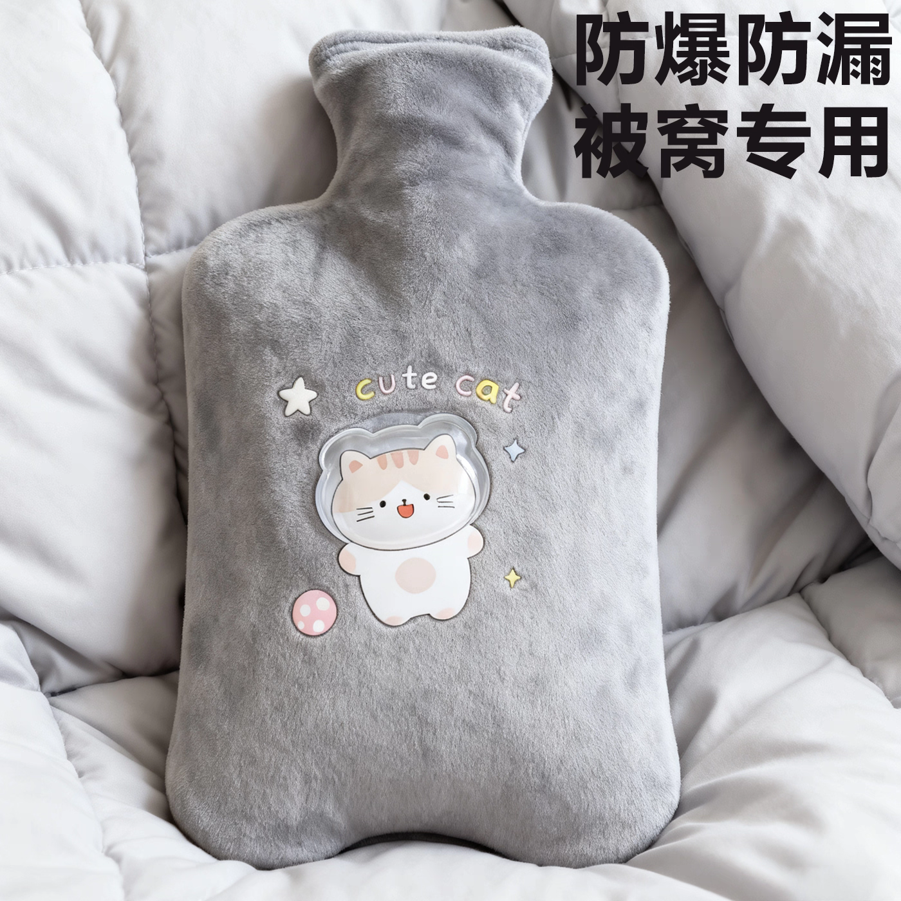

# 十三年腰间盘突出，被一只热水袋、一片暖宝宝、一根腰枕救了

> 写于 2026 年，记录一个真实、低成本、亲测有效的自救过程。

---

## 我的经历

2013 年开始腰间盘突出，时好时坏，反反复复。这十几年，几乎一直处于隐隐作痛的状态，找不到特别好的办法，就这么硬拖着。

转机出现在去年冬天。

当时下大雪，给家里小孩买了一些暖宝宝上学用。有一天突发奇想：**把暖宝宝贴到腰上试试**。结果一个晚上过去，疼痛真的减轻了很多。从那之后，我开始隔三差五贴，身体状况肉眼可见地在好转。

后来我又配合用家里的热水袋：白天灌上热水，别在腰疼位置对应的裤腰带上；晚上继续用暖宝宝，冷了就换一片。就这么简简单单，疼痛大减。

再后来，我又买了一根腰枕，睡觉时垫在腰下。效果更是上了一个台阶。

**现在，基本感觉不到那种折磨人的痛了。**

---

## 我的三样宝贝

### 1. 热水袋（日用）
白天灌热水，别在裤腰带处，持续温热敷腰部。

### 2. 暖宝宝（夜用）
晚上贴一片在疼痛位置，整夜温热，帮助消水肿、活气血。

### 3. 腰枕（睡觉时用）
垫在腰下，来回调节位置，释放整个脊柱的压力，还能起到矫形和锻炼作用。

---

## 为什么这三样东西有用？

简单来说：

- **热敷消水肿、活气血**  
  热水袋日用，暖宝宝夜用，持续的热敷能促进局部血液循环，减轻神经根水肿，疼痛自然缓解。

- **腰枕调节脊柱，释放压力**  
  脊柱是一整根，从尾椎到胸椎、颈椎都相互关联。睡觉时把腰枕垫在不同位置，来回调节，找到让痛点压力最小的那个角度。  
  同时，因为身体自身重量，垫腰枕可以温和地拉伸、锻炼腰部深层肌肉，对脊柱的变形也有一点矫形作用。

---

## 腰突恢复六法（我总结的）

这些方法要一起用，而不是只靠某一种：

1. **正念**  
   能腰突，往往是在思想上、生活习惯上出了某些问题。要先正视它，不再逞强，不再吃不必要的苦。
2. **躺休**（睡着更好）  
   让腰椎真正得到休息。
3. **热敷**  
   热水袋、暖宝宝，持续给腰部温热。
4. **矫正（矫形）**  
   用腰枕等工具，在躺卧时温和调节脊柱位置。
5. **力炼（腰部力量）**  
   在疼痛减轻后，适当锻炼腰背核心肌肉，给脊柱更好的支撑。
6. **生长**  
   人体有自我修复能力，只要还没到最坏的程度，给它条件，它就会慢慢长好。

**正念第一，六法齐用。热敷、腰枕、休息、锻炼，相互配合，身体会给你回报。**

---

## ⚠️ 温馨提醒

方法虽好，安全第一。使用前请一定注意以下事项：

- **谨防低温烫伤**：暖宝宝**严禁直接贴在皮肤上**，必须隔着一层内衣。睡觉时使用更要格外留意，最好睡前贴，醒来摘掉。感觉过热或发痒，马上移除。
- **热水袋检查**：灌水前检查热水袋有没有老化、漏水。水**不要灌刚烧开的沸水**，装七分满，排出空气后拧紧盖子。最好用毛巾包一层再接触身体。
- **不是人人都适合**：皮肤对热不敏感的人（比如糖尿病患者、老年人）、有皮肤破损、急性炎症肿胀期，不建议热敷。如果疼痛突然加剧或出现麻木无力，请**立刻停止，先去医院**，别硬扛。
- **腰枕高度要适中**：以躺下后腰部有轻柔支撑、不悬空、也不觉得硌为宜。如果睡醒后更痛，说明高度或位置不对，调整后再试。
- **以上仅为个人经验分享**：**不构成医疗建议**。每个人情况不同，请务必根据自己的实际感受调整，必要时一定咨询专业医生。

---
## 最后

一只热水袋，一片暖宝宝，一根腰枕 ——  
十多年的老毛病，竟然是被这三样便宜的小东西给按住了。真心感恩。

如果你也被腰突折磨，希望我的经历能给你一点点信心和启发。

**如果这篇文章对你有帮助，欢迎请我喝杯热茶 ☕**

| 微信打赏 | 支付宝打赏 |
| :---: | :---: |
|  |  |

> 所有文章首发于 GitHub，原创不易，转载烦请注明出处。
